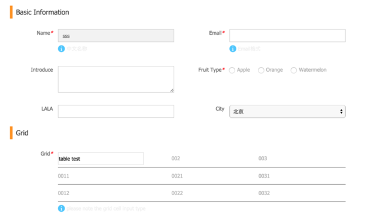

# Form

- order: 7
- tag: uxcore, form
- description: stupid form
- maintainers: 骁勇
- version: 1.0.1
- lastupdate: 8/8/2015
- screenshots: example/screenshot.png

---




## TL;DR

## Feature List/特性


## Usage 最佳实践 [demo](http://uxcore.github.io/uxcore-form/)

```sh
$ git clone https://github.com/uxcore/uxcore-form
$ cd uxcore-form
$ npm install
$ npm run dev
```

### Apply scope

* uxcore-form, including form common validation, layout etc

## API

*  Attr

    * jsxname
    * jsxdata
    * jsxmode
    * jsxprefixCls
    * jsxrule
    * jsxvalue
    * jsxdisabled

* Form API

    * doValidate
    * isDirty

* Form Field API

    * handleChange
    * doValidate
    * renderField
    * renderViewField
    * isDirty

## how to contribute common form field

    ```

     right now just have input/select/radio FormField, missing like select2/checkbox/calendar etc

    ```

    * extends FormField
    * overwrite renderField/handleChange/getValue , see inputFormField.js implementation

## how to add custom form field

 - see the demo code

    ```
     <FormRow>
        <FormField jsxtext="Custom grid" jsxname="table" jsxtips="pls note" jsxrule={{required: true,message:"not empty"}} jsxvalue="table test">
            <TableTest/>
        </FormField>
    </FormRow>
    ```

- FormField prepare jsxmode, jsxvalue,handleDataChange callback and context for custom formfield

    ```
        return React.cloneElement(child, {
            jsxmode:me.props.jsxmode,
            jsxvalue: me.state.value,
            handleDataChange: me.handleDataChange,
            context: me
        });
    ```
 - so custom formfield use below data ,callback , do self logic implementation


## Vaidate mechanism

*  jsxrule have the frist priority
*  if no jsxrule, that's should be the custom field, so we invoke the
custom field doValidate(data) method, and same time pass the whole form
data for it, that should be enough for custom field validate requirement
*  more information ,please see fieldField.js source code

## work flow

* Form-> Render-> FormField register to Form (this.fields) by jsxname
* FormField -> Render -> view UI or Edit UI
* FormField -> data Change -> use handleDataChange hook method pass back to Form

## Demo code

* see example/demo.html when launch the webpack server

````
import React from 'react';
import ExampleCode from "examplecode";
import RCForm from "../index";
import TableTest from "../__test/table"

let Form = RCForm.Form;
let InputFormField = RCForm.InputFormField;
let TextAreaFormField = RCForm.TextAreaFormField;
let FormField = RCForm.FormField;
let Button = RCForm.Button;
let FormRow = RCForm.FormRow;
let RadioGroupFormField= RCForm.RadioGroupFormField;
let SelectFormField= RCForm.SelectFormField;
let FormRowTitle= RCForm.FormRowTitle;

var  Form1 = React.createClass({
  doClick: function(){
     this.refs.myform.doSave();
  },
  render: function() {
    return <div>
                <div className="site-type">多列表单22</div>
                <div className="site-container">
                <Form jsxmode="EDIT" ref="myform">
                    <FormRowTitle title="Basic Information">sss</FormRowTitle>
                    <FormRow>
                        <InputFormField  jsxdisabled className="one-half"  jsxtext="Name"  jsxname="name" jsxtips="中文名称" jsxvalue="sss" jsxrule={{required: true , message: "not empty"}}/>
                        <InputFormField  className="one-half"  jsxtext="Email" jsxname="email" jsxtips="Email格式"  jsxrule={{required: true,type:"email",message:"should be email"}}/>
                    </FormRow>

                    <FormRow>
                        <TextAreaFormField  className="one-half" jsxtext="Introduce" jsxname="introduce" ></TextAreaFormField>
                        <RadioGroupFormField  className="one-half" jsxtext="Fruit Type" jsxname="fruit"  jsxvalue=""   jsxrule={{required: true , message: "not empty"}}>
                            <input type="radio" value="apple" />Apple
                            <input type="radio" value="orange" />Orange
                            <input type="radio" value="watermelon" />Watermelon
                        </RadioGroupFormField>
                    </FormRow>

                    <FormRow>
                        <InputFormField  className="one-half"  jsxtext="LALA" jsxname="lala" />
                        <SelectFormField className="one-half"  jsxtext="City" jsxname="city">
                            <option >请选择</option>
                            <option value="bj" selected>北京</option>
                            <option value="nj">南京</option>
                            <option value="dj">东京</option>
                            <option value="xj">西京</option>
                        </SelectFormField>
                    </FormRow>
                    <FormRowTitle title="Grid">sss</FormRowTitle>

                    <FormRow>
                        <FormField jsxtext="Grid" jsxname="table" jsxtips="please note the grid cell input type" jsxrule={{required: true,message:"not empty"}} jsxvalue="table test">
                            <TableTest/>
                        </FormField>
                    </FormRow>
                    <FormRow><Button jsxtext="Submit" onClick={this.doClick.bind(this)} /></FormRow>
                </Form>
                </div>
        </div>
  }
});

React.render(<Form1/>, document.getElementById('box1'))
````
